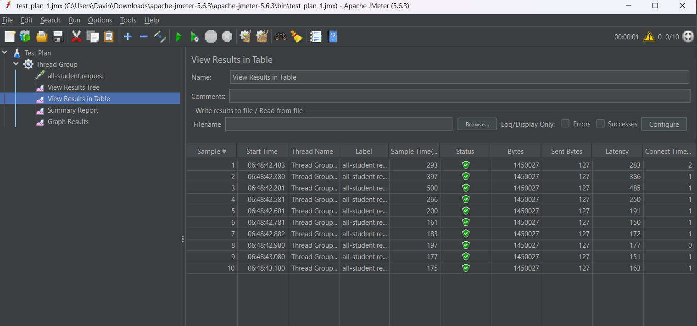
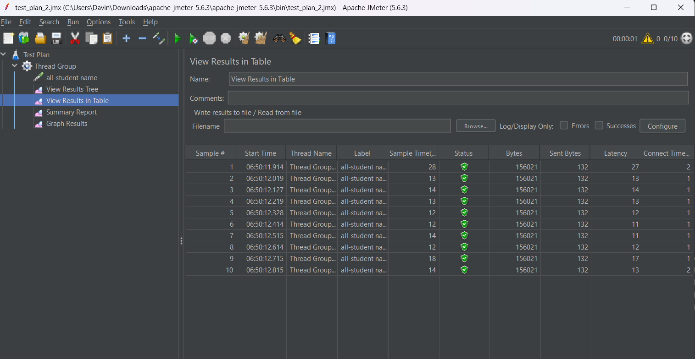
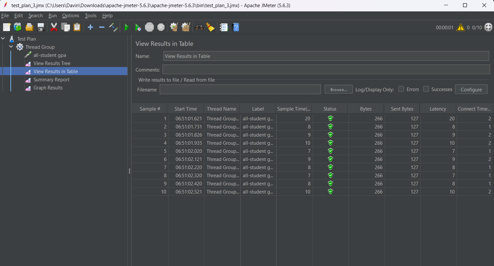

## Module 7 Notes

### Disclaimer
SEED SIZE saya ganti dari 20k menjadi 10k.

### Test Result 1 JMeter

### Test Result 2 JMeter

### Test Result 3 JMeter

### Test Result 1 CMD

### Test Result 2 CMD

### Test Result 3 CMD

## After Optimizing

### Test Result 1 JMeter

### Test Result 2 JMeter

### Test Result 3 JMeter

## Notes
Dari kedua segmen, bisa terlihat bahwa perbedaan antara sebelum dan sesudah optimize begitu jauh.
Hal ini terjadi karena pada kode sebelum optimize, kode melakukan fetching ke database setiap iterasi, yang tentu memakan banyak waktu.
Setelah di optimize, kode melakukan query secara kolektif/barengan, sehingga waktu dapat dipangkas sangat jauh.